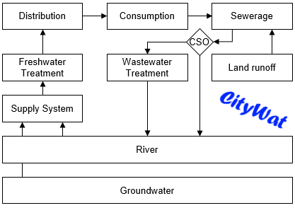

# CityWat
A Modular Lumped Urban Water Cycle Model.

The CAMELLIA project (https://www.imperial.ac.uk/environmental-and-water-resource-engineering/research/camellia/) required the creation of a water cycle model of London that covers supply, wastewater and river quality. 
Our aim was to perform mass balance calculations covering the entire urban water cycle at a lumped citywide scale. 
We wanted a software that is simple but highly customisable so that it can accomodate the unique operational situation that London's water finds itself in. We could not find an easy to use and open-source modelling software up to the task. 
Thus, we created CityWat. 

## Philosophy
CityWat enables a user to create a model object (defined in ``scripts\models.py``), which has a range of sub-models that can be added to it. 
Each sub-model represents a different water cycle process (e.g. abstraction, distribution, etc.) at the city scale. 
Information is shared via updating the model object's state variables, thus updating these state variables correctly ensures preservation of mass balance. 
Model objects also have a range of parameters that are used in the various sub-models. 
These parameters are currently set to represent the lumped values for London's urban water cycle (found in ``scripts\initialise.py``).
Implementation of options or interventions is simple to do in CityWat, provided that the options can be translated to a lumped city scale. 
We provide a list of options at a London scale (found in ``scripts\options.py``).

When running in simulation mode, CityWat simply loops over all of the included sub-models for each timestep - daily in its current timestep. This provides extremely fast run times (under 1 second for over 40,000 timesteps on a 3GHz PC). 

An example CityWat schematic.

## Citation
If you have any questions about using or running the code, or are wish to tailor it to a new case study, please contact b.dobson@imperial.ac.uk.

[]

## Getting Started
These instructions will help you install a copy of CityWat and run our example case for London.

### Requirements
CityWat has been developed using Python 3.7.4. 
This is most easily installed with Anaconda by following instructions at: https://docs.anaconda.com/anaconda/install/.

The following Python modules are required: 
 - numpy
 - pandas
 - tqdm
 - matplotlib
 
If using Anaconda these can be installed by adding the channel 'conda-forge' (see https://docs.anaconda.com/anaconda/navigator/tutorials/manage-channels/ for adding channels), then adding each module (see https://docs.anaconda.com/anaconda/user-guide/tasks/install-packages/).

CityWat has been tested using Python 2.7.15. ``from __future__ import division`` will need to be added to the top of each script if using Python 2.7.X.

### Install
Download or clone this repository.

### Try an example application
- Open Python using your IDE of choice, starting 'Spyder' from Anaconda is recommended for those new to Python.
- Navigate to and open ``scripts\example.py``.
- Run the script by pressing F5.

## Documentation
This paper, its Supporting Material and the User Manual cover the following topics:

- **Paper**: 
- **Supporting Material (full)**: 
- **User Manual**: 

## License
CityWat is licensed under the XXX

## DOIs of previous releases
- v1.0: dx.doi.org/

## Acknowledgements
